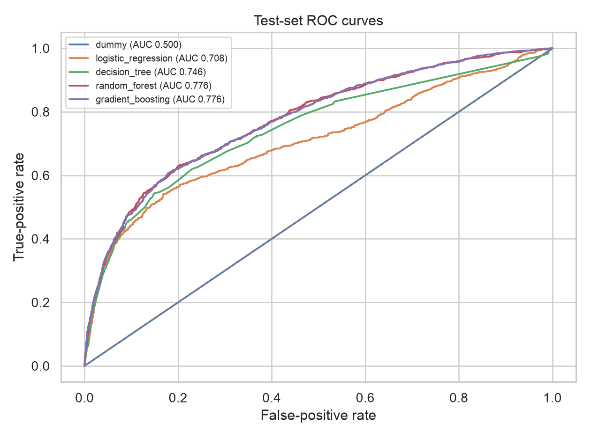
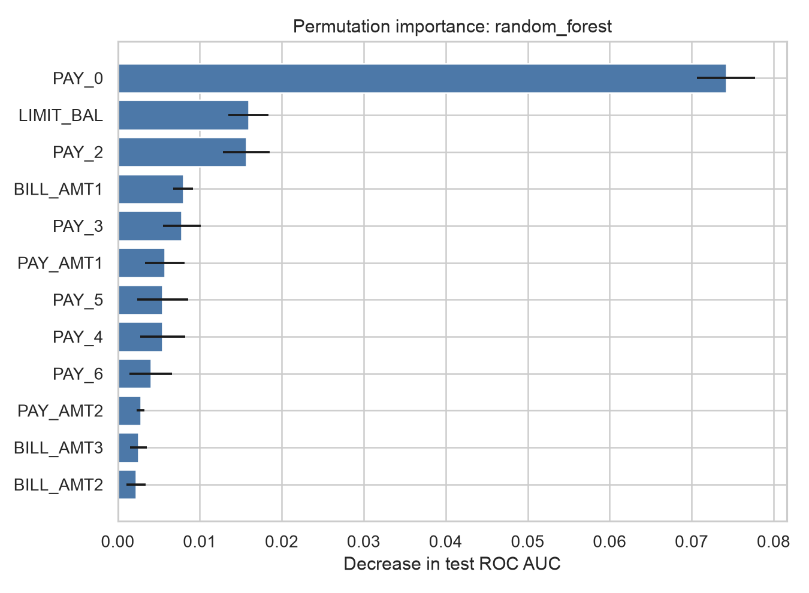

# Interpretable Credit Default Risk Modelling

This project estimates whether a credit-card client will default in the next
month. It is designed as a first complete machine-learning project for a
Mathematics with Finance student who has studied probability, statistical
modelling, distribution theory, linear algebra, operational research and
financial mathematics.

The project is deliberately built from an interpretable statistical baseline to
more flexible machine-learning models. Neural networks are outside the initial
scope. The aim is to understand and defend every modelling decision, not merely
to maximise a score.

## Research question

Can the probability of default next month be estimated from information
available at the prediction date, and how should the classification threshold
change when missing a default is more costly than incorrectly rejecting a
non-defaulting client?

## Dataset

- Source: UCI Machine Learning Repository, Default of Credit Card Clients
- DOI: https://doi.org/10.24432/C55S3H
- Dataset page: https://archive.ics.uci.edu/dataset/350/defaultofcreditcardclients
- Licence: CC BY 4.0
- Population: 30,000 credit-card clients in Taiwan
- Time period: repayment and billing history from April to September 2005
- Predictors: credit limit, demographics, repayment status, bill amounts and
  payment amounts
- Target: default payment in the following month

Because the data are historical and from one market, this is a modelling study,
not a production credit policy for a present-day lender.

## Key results

For a step-by-step Chinese explanation of the question, variables, models,
metrics and conclusions, see [`PROJECT_GUIDE_CN.md`](PROJECT_GUIDE_CN.md).

The experiment uses a fixed stratified 60/20/20 train/validation/test split.
Hyperparameters and the classification threshold are selected without using the
test set. Under an explicitly illustrative cost ratio in which a missed default
costs five times an unnecessary high-risk flag, validation selected a random
forest and a threshold of 0.14.

| Held-out test metric | Result |
| --- | ---: |
| ROC AUC | 0.776 |
| Precision-recall AUC | 0.552 |
| Brier score | 0.135 |
| Precision at threshold 0.14 | 0.338 |
| Recall at threshold 0.14 | 0.808 |
| F1 at threshold 0.14 | 0.477 |
| Illustrative cost per 1,000 | 561.8 |

At the conventional threshold of 0.50, recall was only 0.354. Lowering the
threshold increased recall to 0.808 at the cost of more false positives. This is
a decision trade-off, not evidence that 0.14 is an appropriate bank policy.





## Project stages

### 1 Problem definition and data understanding

#### 1.1 Define the prediction question

Specify the target, prediction date, decision user and practical meaning of a
predicted probability.

#### 1.2 Confirm data provenance

Verify the official source, licence, file hash, population, time period and
variable definitions.

#### 1.3 Audit the raw data

Check the schema, missingness, duplicates, category codes, numeric ranges and
target balance. Make no model-performance claim at this stage.

#### 1.4 Fix modelling rules

Define the leakage boundary, treatment of `ID`, demographic-variable policy and
limits on causal or present-day business claims.

### 2 Interpretable baseline

#### 2.1 Create the modelling table

Recode undocumented categories transparently and separate predictors, target,
identifier and demographic audit fields.

#### 2.2 Split the data

Create stratified training, validation and test sets before learning any
transformation.

#### 2.3 Build baseline models

Compare a dummy classifier with logistic regression.

#### 2.4 Evaluate the baseline

Use the confusion matrix, precision, recall, F1, ROC-AUC, precision-recall AUC
and probability calibration.

### 3 Non-linear machine learning

#### 3.1 Train a decision tree

Study split rules, depth and overfitting.

#### 3.2 Train a random forest

Study bagging, feature subsampling and stability.

#### 3.3 Train gradient boosting

Study sequential error correction and controlled model tuning.

#### 3.4 Compare models

Compare all models on the same untouched test set and against logistic
regression.

### 4 Decision analysis and explanation

#### 4.1 Define error costs

Specify the relative cost of a missed default and an unnecessary rejection.

#### 4.2 Select decision thresholds

Compare operating points without changing the fitted probability model.

#### 4.3 Explain predictions

Use logistic coefficients, permutation importance and SHAP values.

#### 4.4 Audit subgroup behaviour

Compare error rates and calibration with and without demographic predictors.

### 5 Final communication

#### 5.1 Produce reproducible analysis

Organise the final code or notebook so every result can be regenerated.

#### 5.2 Write the technical report

Explain the question, methods, results, limitations and decision implications.

#### 5.3 Write the project summary

Prepare a concise GitHub overview and truthful CV-ready description.

## Current status

The complete reproducible workflow is implemented and verified: source download
and hash checking, raw-data audit, field-role separation, model comparison,
validation-only threshold selection, held-out test evaluation, calibration,
permutation and SHAP explanations, subgroup audit, figures and technical report.

## Reproducible setup

```bash
python3 -m venv .venv
source .venv/bin/activate
python -m pip install --upgrade pip
python -m pip install -r requirements.txt
```

Run the complete analysis:

```bash
python scripts/run_all.py
```

Or run each stage separately:

```bash
python scripts/download_data.py
python scripts/audit_data.py
python scripts/create_modelling_table.py
python scripts/train_evaluate.py
```

Main outputs:

- [`PROJECT_GUIDE_CN.md`](PROJECT_GUIDE_CN.md)
- [`reports/data_audit.md`](reports/data_audit.md)
- [`reports/field_roles.md`](reports/field_roles.md)
- [`reports/model_metrics.csv`](reports/model_metrics.csv)
- [`reports/subgroup_audit.csv`](reports/subgroup_audit.csv)
- [`reports/technical_report.md`](reports/technical_report.md)
- [`reports/figures/`](reports/figures/)

Raw and processed data are excluded from Git. The download script retrieves the
official UCI archive and verifies both the archive and workbook SHA-256 hashes.

## Repository structure

```text
data/          source notes plus ignored raw and processed data
scripts/       download, audit, table creation, training and orchestration
src/           reusable data and evaluation functions
tests/         unit tests for data roles and threshold logic
reports/       metrics, explanations, subgroup audit and technical report
```

## Rules fixed before modelling

- `ID` is never used as a predictor.
- The raw files are never overwritten.
- The test set is not used to choose transformations, features, models or
  thresholds.
- Probability quality and decision costs matter in addition to classification
  accuracy.
- Demographic variables are handled explicitly and audited rather than silently
  included.
- Results are described as associations and predictions, not causal effects.
